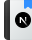

# Next.js Dashboard 📊 &middot; [](http://makeapullrequest.com)

> App based on the official framework course, available in: [nextjs.org/learn](https://nextjs.org/learn)

## Installing / Running

Clone this repository using Git and run:

```shell
npm install
npm run seed
```

now with the database created and seeded, you can run the app:

```shell
npm run dev
```

which will be online in the port [:3000](http://localhost:3000/).

## Technologies and tools used

  