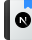

# Next.js Dashboard 📊 &middot; [](http://makeapullrequest.com)


[English](./README-en.md) 👈

> Aplicação baseada no curso oficial do framework, disponível no [course curriculum](https://nextjs.org/learn) no Website do Next.js

## Instalação / Execução

Clone esse repositório utilizando Git e execute:

```shell
npm install
npm run seed
```

agora com o banco de dados criado e semeado, é só rodar a aplicação:

```shell
npm run dev
```

que estará online na porta [:3000](http://localhost:3000/).
